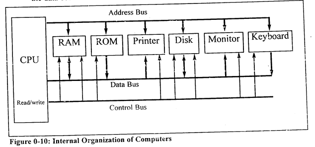

## Looking back at : Mazidi 8051, https://www.amazon.com/8051-Microcontroller-Embedded-Systems-2nd/dp/013119402X

## Two types of memories:

a. RAM - used to store temporary store programs that a computer is running and is lost when the computer is turned off. Volatile, RW memory.  
b. ROM - contains permanent data i.e programs and information essential to operation of a computer. Non-Volatile, cannot be changed.  

## Internal working of every computer can be broken down into 3 parts:

a. CPU - process information stored in the memory, uses Buses to get information or send information to others.   
b. Memory  
c. I/O devices - keyboard or mouse like devices, to provide means of communicating with the CPU. To be recognized by the CPU, it each I/O device should have an address (unique).  
d. Bus - CPU is connected with the memory and I/O devices through stripes of wire called as bus. Carries information from place to place,  
 &nbsp;&nbsp;&nbsp;&nbsp; 3 Bus types:  &nbsp;&nbsp;&nbsp;&nbsp;&nbsp;&nbsp;&nbsp;&nbsp;&nbsp;&nbsp;&nbsp;&nbsp;(i) Address Bus,  &nbsp;&nbsp;&nbsp;&nbsp;&nbsp;&nbsp;&nbsp;&nbsp;&nbsp;&nbsp;&nbsp; (ii) Data Bus,  &nbsp;&nbsp;&nbsp;&nbsp;&nbsp;&nbsp;&nbsp;&nbsp;&nbsp;&nbsp;&nbsp; (iii) Control Bus: provides read or write signals to the I/O device to indicate if the CPU is asking for information or sending it information.  

## Address and Data bus determine the CAPABILITY of the CPU, more on this:

<h4><u>Data Bus</u></h4>
<li>Data bus - more the merrier! as they carry the information in and out of a CPU. But this means expensive CPU and computer.  
<li> Data buses are bidirectional, processing power of a CPU is related to the size of its buses, eg: 8-bit buse send 1 byte at a time, 16-bit bus can send 2 bytes at a time thus faster.</li>

<h4><u>Address Bus</u></h4>
<li>Address bus is used to identify the devices and memory connected to the CPU, again more the merrier! i.e more address buses mean more number of devices can be addressed. In other words, the number of address buses for a CPU determines the number of locations with which it can communicate.</li>  
<li>Number of locations = 2x, x: number of address lines regardless of the data bus.</li>  
 

					 

